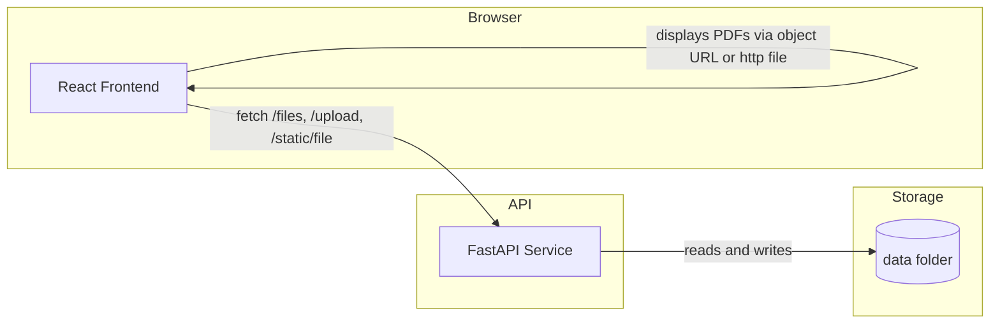
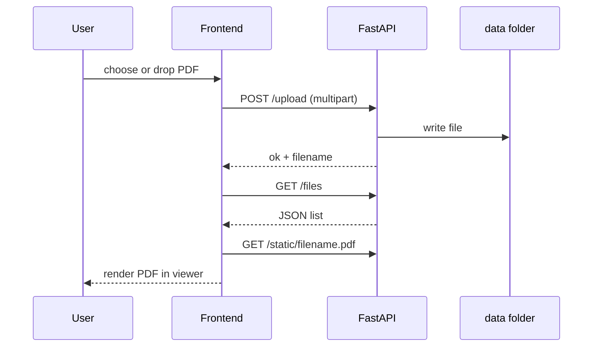
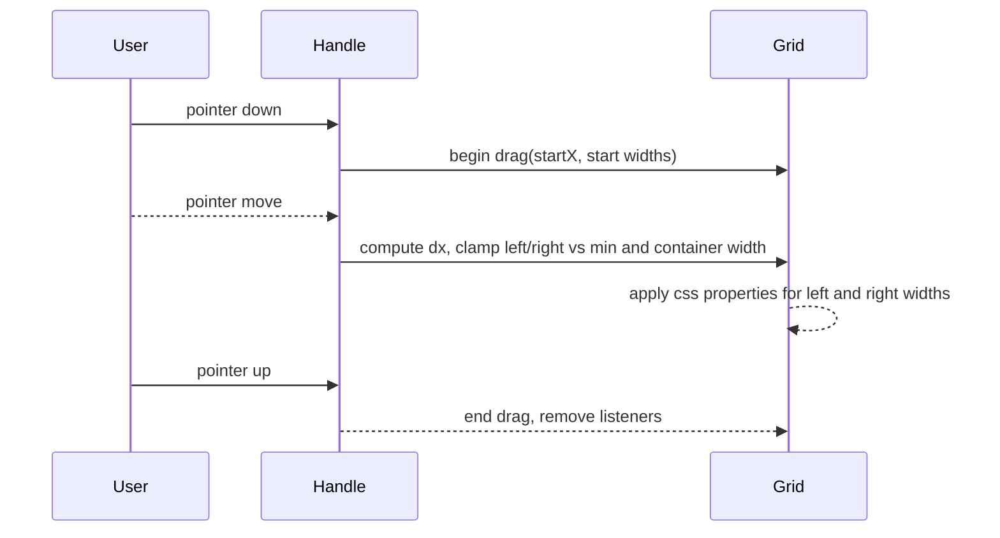

# PDF Workspace

A small project that pairs a FastAPI backend with a React, Vite, and TypeScript frontend. It previews PDFs in a three pane workspace and surfaces document KPIs in a bento grid. This README provides a deeper look at the architecture and data flow, plus setup steps.

## Overview

* Frontend: React plus Vite plus TypeScript. State handled by a tiny store. Layout uses a grid with two draggable separators to resize left and right panes.
* Backend: FastAPI that lists and accepts PDF uploads and serves static files from a data directory.
* Data flow: PDFs can be dropped into the UI or uploaded to the backend. The viewer displays the selected PDF using an object URL or a served static URL. The KPI panel summarizes detected fields; the demo seeds stable values if real extraction is not wired yet.

## System architecture



## Backend design

The API is minimal and focused on file IO and static serving.

```mermaid
graph TB
  A[FastAPI app] --> B[CORS middleware]
  A --> C[StaticFiles mount at /static]
  A --> D[Router]

  D --> E[/health]
  D --> F[/files]
  D --> G[/upload]
  C --> H[(data)]
```

* /health returns a simple status object.
* /files returns a list of files found in the data folder, with name and size.
* /upload accepts a single PDF as multipart form data and writes it to the data folder.
* /static serves files directly from the data folder.

### Typical upload flow



## Frontend design

React with a simple store for documents, selection, and chat messages. The workspace is a three column grid. Two vertical handles let the user resize left and right panes; widths persist in memory and are clamped on container resize.

```mermaid
graph TB
  App --> WorkspaceStep

  subgraph WorkspaceStep
    FT[FileTreeSidebar]
    VH[Viewer]
    RS[RightSidebar]
  end

  RS --> KPI[KpiOnly (bento tiles)]
```

### Component responsibilities

* FileTreeSidebar shows the list of loaded PDFs and lets you select one.
* Viewer renders the active PDF inside an iframe.
* RightSidebar hosts KPI tiles and details.
* The store keeps a map of docs, an ordered list, the selected id, and simple message history.

### Resizing logic at a glance



The grid recalculates the available maximum widths when the container resizes to keep the center area above its minimum width.

## Folder structure

```
pdf-workspace/
  backend/
    app.py
    requirements.txt
  frontend/
    index.html
    vite.config.ts
    package.json
    tsconfig.json
    src/
      App.tsx
      main.tsx
      store/
        useStore.ts
      components/
        Viewer.tsx
        Viewer.css
        RightSidebar.tsx
        steps/
          WorkspaceStep.tsx
          FileTreeSidebar.tsx
          FileTreeSidebar.css
      kpis/
        KpiOnly.tsx
        KpiOnly.css
      styles/
        global.css
        WorkspaceStep.css
  data/
    Sample_KPI_Rich_Contract.pdf
  README.md
```

## Setup

### Backend

```bash
cd backend
python -m venv .venv
# mac or linux
source .venv/bin/activate
# windows
# .venv\Scripts\activate

pip install -r requirements.txt
uvicorn app:app
```

The API listens on port 8000 by default. Visit http://localhost:8000/health

### Frontend

```bash
cd frontend
npm install
npm run dev
```

Open http://localhost:5173

If the API is running, the app attempts to preload the sample PDF found at http://localhost:8000/static/Sample_KPI_Rich_Contract.pdf

## How to use

1. Start the backend and the frontend.
2. Drop one or more PDFs onto the window or use the sample that preloads.
3. Resize side panes by dragging the two vertical handles.
4. Click KPI tiles on the right to open the detail panel for each metric.

## Notes on KPIs

The demo shows counters for counterparts, dates, places, and currency totals. When real extraction is not available, the UI seeds stable pseudo values per document. You can connect a parser by populating overview fields in the store:

* counterparts: string array
* dates: string array
* places: string array
* errors: string array
* money: array of objects with amount and optional currency code

## Accessibility

* Handles are reachable and operable with pointer, mouse, and touch.
* Toggle buttons and dialog controls include labels.
* Live regions announce empty states and chat messages where present.

## Troubleshooting

* If PDFs do not display, verify the file type is application/pdf.
* If the sample is not preloading, ensure the backend is running and that cors is allowed.
* When resizing does not react, confirm the workspace grid element exists and has height.

## Licensing

This demo is provided as-is. Use it as a starting point for your own projects.
